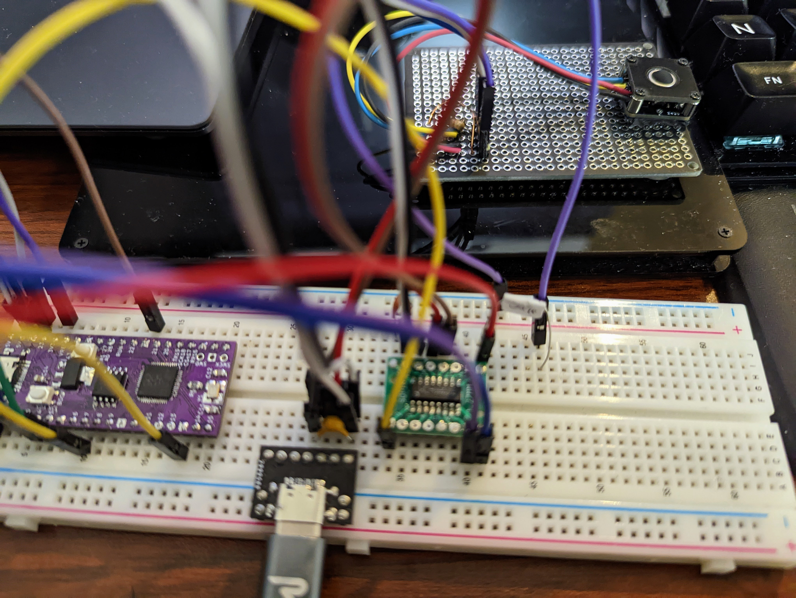

# AZ1UBALL を Raspberry Pi Pico (MicroPython) + CH9329 で動かす

[回路図 circuit.pdf](circuit.pdf)

CH9329 は UART で操作できる、USB Keyboard/Mouse としてふるまう IC。

CH9329 については以下の同人誌が詳しい。

> キーボード／マウス　エミュレータ解説書 みんなのラボ
>
> https://techbookfest.org/product/iaTanH0UsU9j5TPnFT44rF?productVariantID=4Q1yNxZMFWWs9UJbkx7c6b
